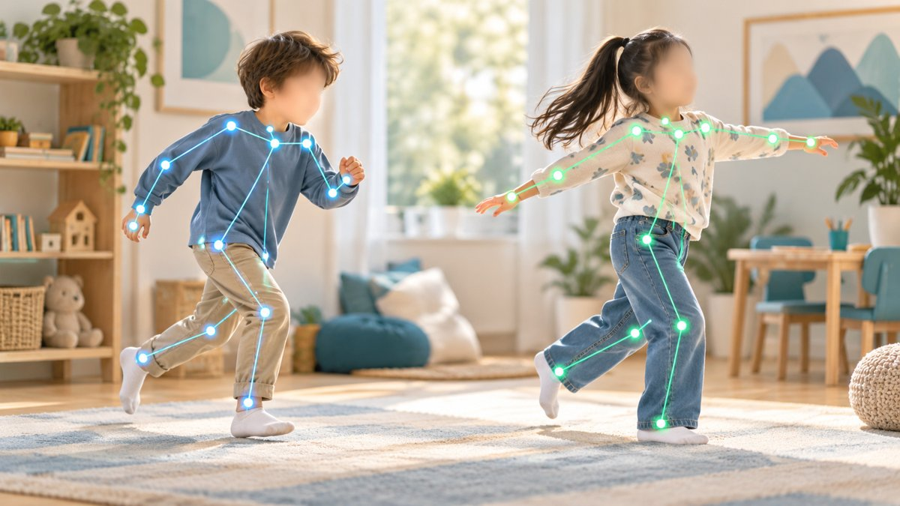

# pose-behavior-pipeline

<p align="center">
  
</p>

<p align="center">
  <b>Multi-camera pose &amp; identity tracking pipeline for child-development research video</b><br>
  SAM3 segmentation &rarr; identity-fragment merging &rarr; pose &amp; 3D depth extraction
</p>

<p align="center">
  
  
  
  
</p>

---

## Overview

Post-processing fix for [psifx](https://github.com/psifx/psifx)'s SAM3
cross-chunk identity tracking, built for CHUV (child neurodevelopment
research video). Vanilla psifx chunks a video for SAM3 tracking and
re-links object ids across chunk boundaries with a single-frame greedy
match -- fragile: anyone occluded, off-screen, or lost mid-propagation
reappears under a brand-new id. This repo runs the real `psifx`
package unmodified and repairs the fragmentation as a whole-video
post-process, then extracts pose and 3D movement on top of it.

**Pipeline:**

1. **SAM3** (real psifx) -> raw, fragmented per-chunk masks.
2. **OSNet + color signatures** give each mask fragment an appearance
   fingerprint.
3. **Heuristic merge** (global Hungarian assignment + a same-time
   overlap resolver) re-links fragments back into persistent identities.
4. **Pose**: MediaPipe PoseLandmarker per identity, confidence-gated
   and stabilized with a One Euro Filter.
5. **Depth** (Azure Kinect sessions): each keypoint gets a real 3D
   `(X, Y, Z)` from the camera's own depth stream, then per-person
   movement metrics (distance, velocity, variability).
6. **Cross-camera registration** (optional, two-camera sessions):
   aligns two cameras' 3D skeletons via a shared physical reference.

See [docs/ARCHITECTURE.md](docs/ARCHITECTURE.md) for the full module
layout and the pose step's provenance.

## Setup

```bash
python3 -m venv .venv && source .venv/bin/activate
pip install -r requirements.txt
pip install torch torchreid gdown tensorboard mediapipe
```

Plus `psifx` itself (not a PyPI package), a gated SAM3 checkpoint, and
(for the depth step) the Azure Kinect SDK. Full instructions,
including a known SAM3/PoseLandmarker/Kinect SDK setup gotchas, in
[docs/SETUP.md](docs/SETUP.md).

## Usage

```bash
cd src
python -m segmentation.run_pipeline --video ~/Bureau/The\ Sense/Sessions/9_group_1_3/camera_a.mkv \
    --ss 00:22:34 --to 00:27:40 --device cuda
```

One resumable pass: transcode -> SAM3 -> merge -> overlay -> crop
border artifact -> overlay on cropped output. Each step is skipped if
its output already exists (`--overwrite` to force a re-run).

Pose extraction, 3D depth/movement metrics, cross-camera registration,
and training the overlap classifier are each one more command on top
of this -- full usage and real-session validation notes in
[docs/USAGE.md](docs/USAGE.md).

## Known limitations

Needs a CUDA GPU; no face-blurring/anonymization step yet (required
before any video of minors leaves a controlled environment); a few
steps are validated on real sessions but not yet broadly stress-tested.
Full list, with what's been verified on real data and what hasn't, in
[docs/LIMITATIONS.md](docs/LIMITATIONS.md).

## Ethics & privacy

Video of minors in a clinical context requires face blurring as early
as possible (see [docs/LIMITATIONS.md](docs/LIMITATIONS.md) -- not
currently implemented), compliance with Swiss LPD and, where
applicable, GDPR, and separation of raw video from derived features
with distinct retention policies.
